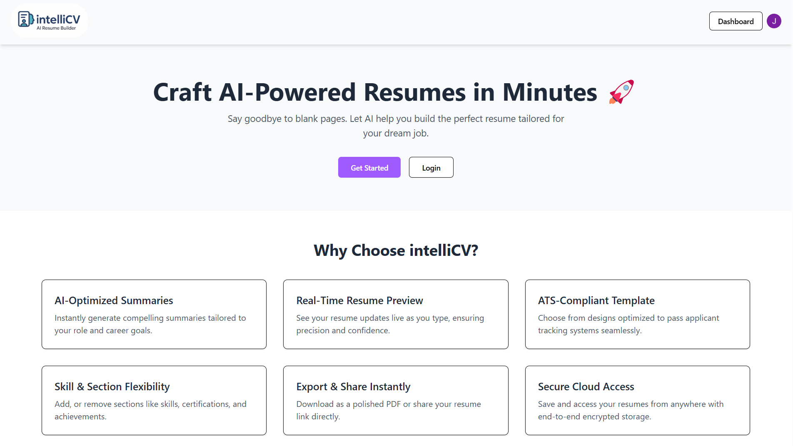
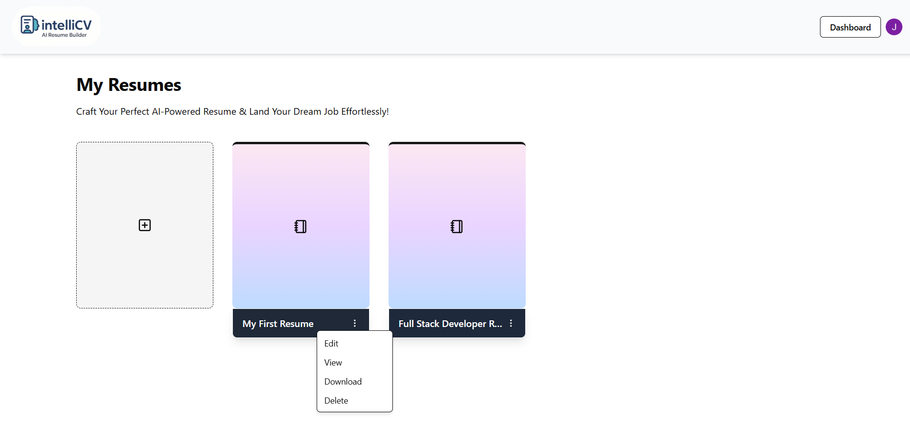
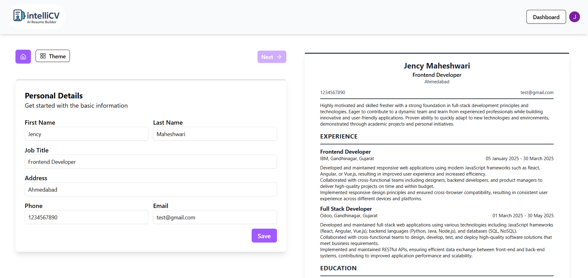
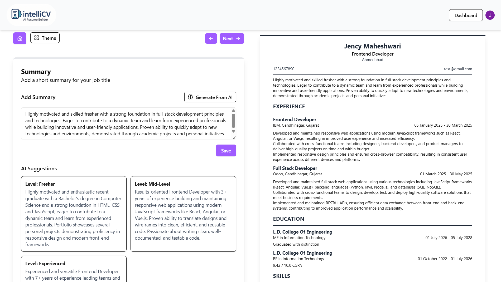
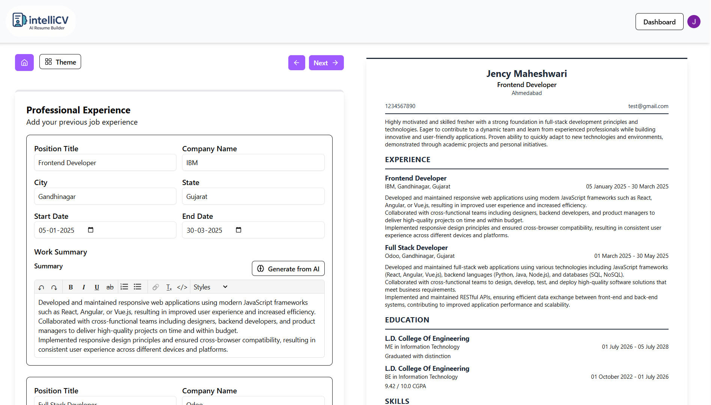
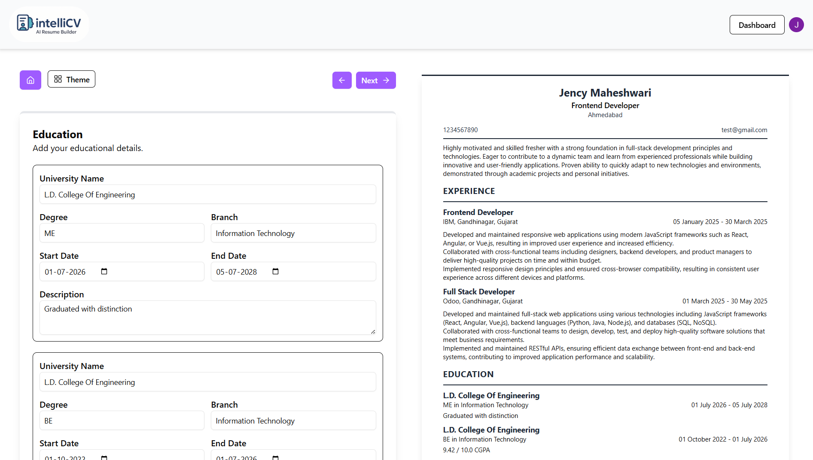
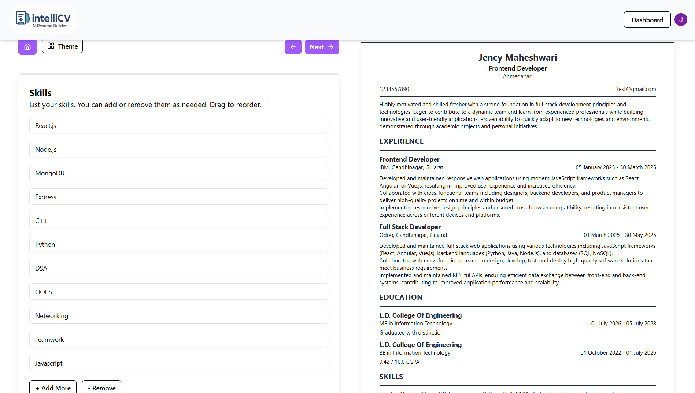
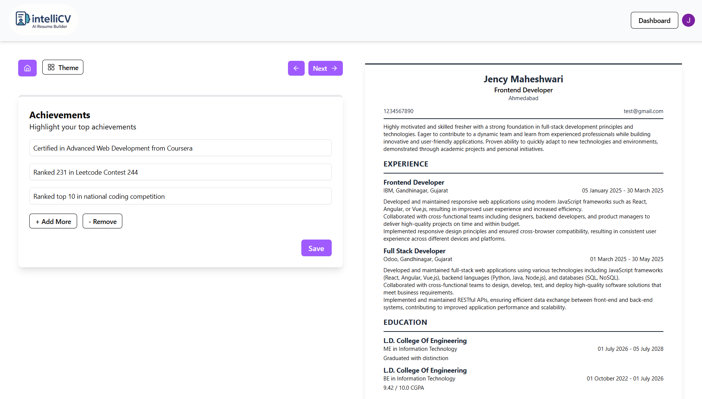
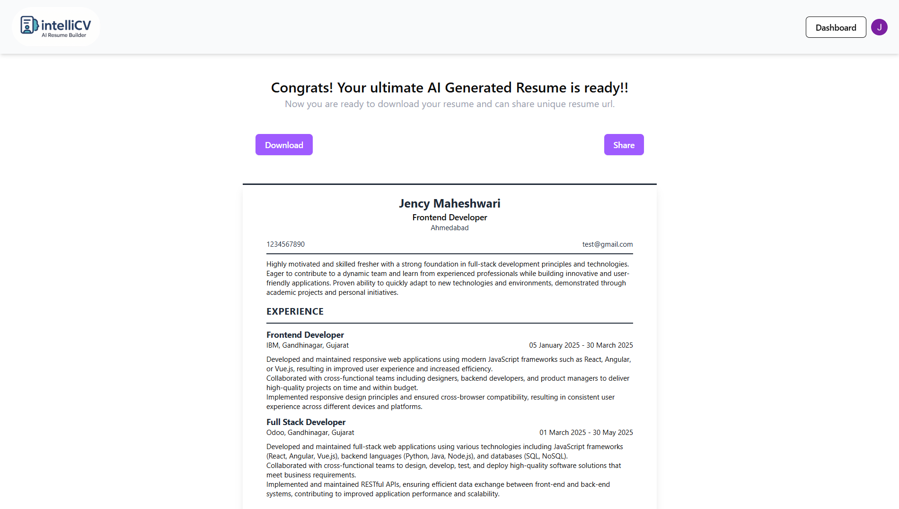
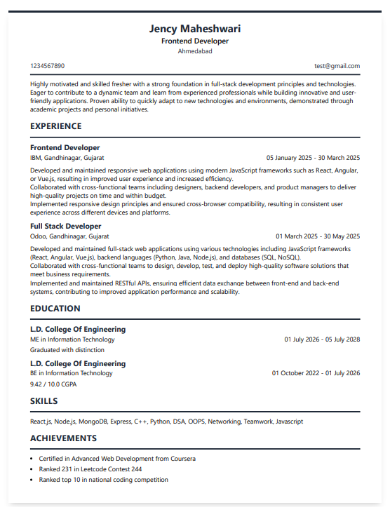

# 🧠 intelliCV : AI-Powered Resume Builder

IntelliCV is a powerful and intuitive resume builder platform designed to help users create professional resumes quickly using real-time previews and AI assistance.

---

## 🚀 Features

- 🧾 **Multi-Step Resume Builder**:
  - Personal Information
  - Professional Summary
  - Work Experience
  - Education
  - Skills
  - Achievements
-  🔐 **User Authentication** with Clerk (Sign In, Sign Up, Secure Access)
- 🧠 **Generate with AI** Button for auto-filling Summary
- ✏️ **Flexibility to Add or Remove Details** like skills, achievements, experience, and more
- 📄 **Live Resume Preview** that updates in real-time as user types
- 📥 **Download & Share Options** after resume completion
- 📊 **User Dashboard** showing all created resumes in a card layout
- 💾 **Data Persistence** with localStorage + Strapi backend
- 📱 **Fully Responsive** for Mobile, Tablet, and Desktop
- 💬 **User-Friendly Interface** with modern design and smooth transitions

---

## 🧑‍💻 Tech Stack

- **Frontend**:  
  - React.js (SPA)  
  - Tailwind CSS (Utility-first styling)  
  - Lucide Icons (for consistent iconography)  
  - React Router DOM (Routing and navigation)

- **Authentication**:  
  - Clerk (for secure and seamless user login, signup, and user state management)

- **Backend**:  
  - Strapi (Headless CMS for Resume data management)  
  - REST API-based communication between frontend and backend

---

## 🔎 Preview

### 🌿 Landing Page Preview

---

### 🖥️ Dashboard View

---

### 🔐 Sign-in / Sign-out Preview

---

### 👤 Personal Detail Form

---

### 🧠 Summary Form

---

### 💼 Experience Form

---

### 🎓 Education Form

---

### 🛠️ Skills Form

---

### 🏆 Achievements Form

---

### 📤 Download/Share Options

---

### 📄 Final Resume Preview

---

 

Thank you for checking out <strong>intelliCV</strong>! 🧾  
If you like this project, feel free to give it a star! ⭐  

